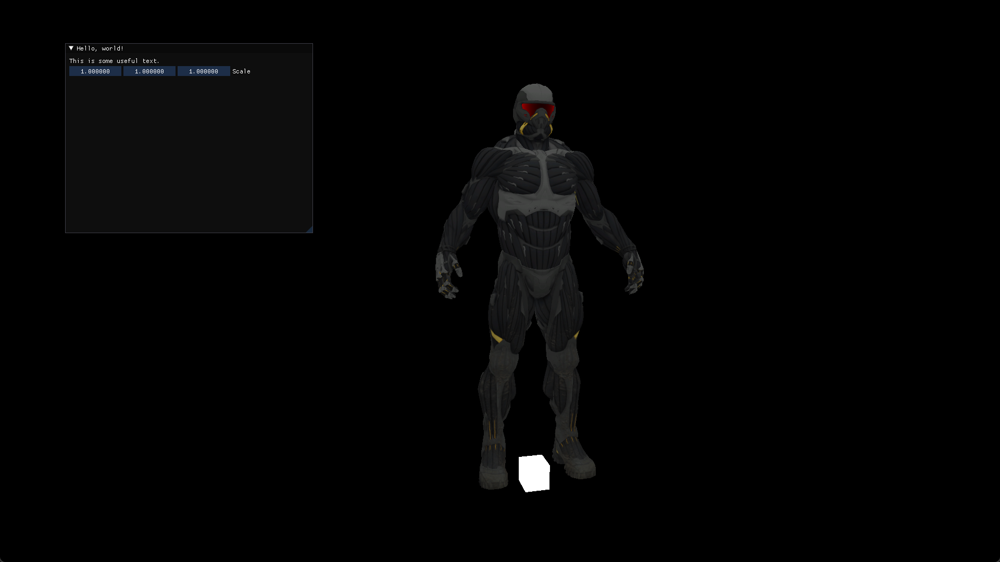

# myTinyOpenglRender

This is an tiny render based on OpenGL.

### Include features：

- camera:white_check_mark:   
- controller:white_check_mark:   
- light:white_check_mark:   
- model import:white_check_mark:   
- texture:white_check_mark:   
- Materials<WIP>
- GUI<WIP>

Latest screenshot (not final):

### Contorl:

Like Unity, pressing right button and **W A S D E Q** key can transfrom the camera position. Maybe another functions will be added.

### envirment and include package:

- OpenGL 4.6
- glew for extension
- glfw 3.3.7 for window managment
- glm for math
- imgui v1.88 for GUI
- assimp 5.2.4 for loading models

Visit my [website](https://www.cnblogs.com/woden3702/category/2188557.html) for details.

